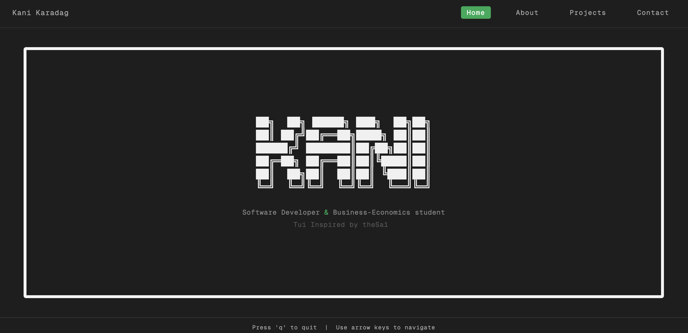

# TUI Style Portfolio

A terminal-inspired personal portfolio built with React. Navigation works via arrow keys or the nav bar, giving it the feel of a TUI (Text User Interface) application running in the browser.



## Features

- TUI-inspired dark aesthetic with monospace typography
- Keyboard navigation (arrow keys left/right to switch pages)
- Pages: Home, About, Projects, Contact
- ASCII-art style name display on the home screen

## Tech Stack

- React + TypeScript
- CSS Modules
- Vite

## Getting Started

```bash
npm install
npm run dev
```

## Keyboard Shortcuts

| Key | Action |
|-----|--------|
| `Arrow Left` | Previous page |
| `Arrow Right` | Next page |

## Inspiration

TUI design inspired by [theSa1](https://github.com/theSa1).
